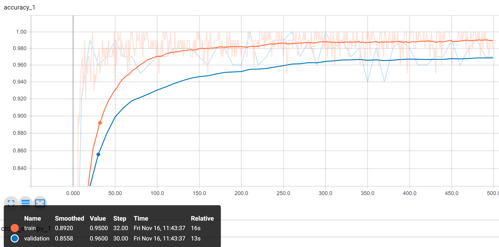

## Code

This directory contains the code for the Google vision model built on top of a pre built image trained on imageNet data. The three main scripts in this directory train a model and classify test images based off that model.

### script.sh

This shell script is simply used to give a template of the command that should be ran in order to train the model for the first time. The retrain.py python script expects that it will recieve a directory with nested directories of different classes of images that it can learn from. In our case, the nested directories correspond to unique dog breeds.

### retrain.py

This script was provided by tensorflow and can be found [here](https://github.com/tensorflow/hub/blob/master/examples/image_retraining/retrain.py). The idea of the script is that training a model from scratch takes several GPU hours and is not trivial. In addition, most uses of tensorflow require large amounts of data which in our case was not easily available. To make up for this, the retrain.py script has previously built a model which has trained on imageNet data. ImageNet is an image database with large amounts of data which can be used to train models. The benefit of training a model on images that might not be related to our classification in anyway is that it allows the model to learn features that are transferable between images, such as edges, color scale, shapes etc. Once we have this imageNet trained model, we can simply add another layer on top of the model which is specific to our classification problem of dog breeds. The retrain.py script spits out a .pb file which is essentially the model written to disk, which reduces future classification time because it can be simply passed in to tensorflow as an object.

### classify.py

The classify.py script was written by us and is responsible for actually classifying the breeds of new images. This works by iterating over every test image of a dog and feeding it into the saved model in the .pb file. The model then spits out it's confidence for each breed and we select the highest confidence as the overall prediction. For example if the model takes an image of a dog and says "95% sure its a pug, 2.5% sure its a bulldog, 2.1% sure its a hound, 0.1% sure its a samoyed.... etc" We can say with 95% confidence that the dog is a pug. We then record all of the correct classifications and compare it to the total number of classifications at the end.

### Results

### API

#### Training
During training, the api preformed very well, averaging 99% accuracy as shown in the diagram.
